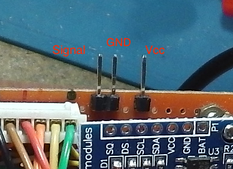

.. include:: links.rst

=======================
Documentation technique
=======================

Divers
======

Voir :

* le `dépôt sur github`_
* le `sketch de l'arduino sur github`_

Photo de l'intérieur du thermostat
==================================

.. image:: ThermostatInterieur.png

Liste des éléments
==================

Les N° ci-dessous des éléments correspondent aux N° de la photo ci-dessus.

1. :index:`Arduino` NANO
2. Module :index:`RTC` (:index:`I2C`) **DS1307**
3. Connecteur d'arrivée de l'alimentation (**+** vers Vin de l'arduino)
4. connectique vers bouton **-**, bouton poussoir **13**
5. connectique vers bouton **+**, bouton poussoir **14**
6. connectique de gestion du commutateur 3 positions et des LEDs qui lui sont associées
7. connectique vers le relai SSR
8. résistance des ponts diviseurs associés au commutateur 6 positions (**12**)
9. ensemble des potentiomètres des ponts diviseurs associés au commutateur 6 positions (**12**)
10. connectique I2C vers l'afficheur OLED 0.96\"
11. connectique vers la sonde de température DS18B20
12. commutateur 6 positions de choix des modes de fonctionnement
13. bouton poussoir **-**
14. bouton poussoir **+**
15. interrupteur Marche/Arrêt
16. afficheur OLED 0.96\"
17. commutateur 3 positions
18. LED jaune (non visible sur cette photo)
19. LED bleue (à peine visible sur cette photo)
20. PCB de récupération avec le connecteur RJ45 pour les m-à-j de l'arduino via ISP/ICSP

Le rôle de l'arduino NANO
=========================

Rôles INPUT

1. capter la température de la pièce avec la sonde DS18B20
2. Déterminer le mode de fonctionnement avec le commutateur 6 positions (**12**)
3. gérer les commandes des réglages avec les boutons poussoirs et le commutateur 3 positions (**17**)

Rôles OUTPUT

1. Rôle principal : **Activer/Désactiver le relai SSR**
2. afficher les données sur l'écran OLED (**16**)
3. allumer/éteindre les LED bleue et jaune
4. Plus tard : transmettre les données par le bus SPI (**20**)

Les interruptions
=================

Les interruptions sont gérées sur les *Digital Pins* 2 et 3. Elles sont utilisées pour les
réglages de température de consigne et de l'heure.

Deux particularités :

* un algorithme pour s'affranchir des rebonds. Voir pour cela la vidéo
  d'Eric Peronnin dont l'URL est donnée dans le code au niveau
  de la fonction :code:`btn1()`
* l'appui sur les boutons poussoirs n'a pas le même effet selon le mode. Pour tous
  les modes sauf le **5**, on modifie la température de consigne, pour le mode **5**,
  on modifie les heures et les minutes.

::

  void setup() {
    ...
    pinMode(PLUS_PIN, INPUT_PULLUP);
    pinMode(MINUS_PIN, INPUT_PULLUP);
    attachInterrupt(digitalPinToInterrupt(BTN1), btn1, FALLING);
    attachInterrupt(digitalPinToInterrupt(BTN2), btn2, FALLING);
    ...

le module RTC DS1307
====================

Ce module est simple d'utilisation, il connecté à l'arduino par I2C.

Dans le mode **5**, on règle les heures et minutes.

NB: on ne se préocupe pas ici de gérer la date.

Ces réglage se font dans la fonction :code:`void timeUpdate(bool PlusOrMinus)` qui est appelée
dans la fonction ``loop()``.

Mode opératoire :

1. on est dans le mode **5**
2. on appui sur un bouton poussoir (i.e *Plus*)
3. dans la fontion d'interruption :code:`btn2()`, la variable globale ``timeUpdatedPlus`` est mise à **1** (resp. ``timeUpdatedMinus``)
4. un test est fait à chaque passage dans la fonction ``loop()``, et si cette varialble est à **1**, on appelle
   la fonction :code:`void timeUpdate(bool PlusOrMinus)` avec **1** comme paramètre (resp. **0** si bouton *Moins*)
5. dans la fonction :code:`void timeUpdate(bool PlusOrMinus)`, on regarde la position du commutateur 3 positions
   et en fonction de ce commutateur, on modifie les heures ou les minutes.
6. dans la fonction ``timeUpdate()`` toujours, on remet à **0** les variables ``timeUpdatedPlus`` et ``timeUpdatedMinus``

le relai SSR et la connectique
==============================

Un relai SSR a été installé au lieu d'un relai électro-mécanique car ces relais consomment moins.

Ce relai est connecté à la pin 8 de l'arduino

:code:`#define HEATING_PIN 8`

la commande de celui-si se fait dans la fonction :code:`void heating(bool On)` :

* si la variable ``On`` est vraie, le relai est activé si il n'a pas eu de changements dans les 40 dernières secondes.
* si la variable ``On`` est fausse, le relai est désactivé si il n'a pas eu de changements dans les 40 dernières secondes.

Ces **40** sont déclarées dans la macro ``#define HEATING_DELAY 40000000 /*!< 40000000 uSec = 40sec. */`` et sont *un peu arbitraires*.
Ce délai permet d'éviter des changements intempestifs et brutaux de l'activation et désactivation de la :index:`PAC`. Il se trouve aussi que la PAC
elle-même a un mécanisme de délai qui peut être de plusieurs minutes.

La sonde de température DS18B20 et sa connectique
=================================================

Il existe deux types de sonde DS18B20 : en boitier TO-92 et sous forme d'une sonde étanche dans un *tube* inox. C'est ce
deuxième modèle qui est utilisé ici.

* communication avec l'arduino par le protocole *OneWire*
* sur la photo en haut de cette page, *rouge* = Vcc, *noir* = GND, *jaune* = OneWire
* ``#define DS18B20_PIN 9`` : *jaune* connectée à la Digital Pin 9 de l'arduino

Les modes de fonctionnement et les ponts diviseurs
==================================================

Le mode de fonctionnement est déterminé par la lecture d'une valeur analogique sur la pin **A2** de l'arduino.
Cette valeur est fonction de la configuration du pont diviseur créé par

* une résistance (**8**) de 4.63k
* un ensemble de potentiomètres (**9**)
* alimenté en 5V, la sortie 5V de l'arduino
* la position du commutateur 6 positions (**12**)

Les valeurs lues correspondent à des valeurs des résistances des potentiomètres dont les valeurs approximatives
sont données dans le tableau ci-dessous :

  +-----------------------+-----+-----+-----+-------+-------+-----+
  | **résistances  en Ω** | 170 | 178 | 968 | 2.13k | 7.61k | 34k |
  +-----------------------+-----+-----+-----+-------+-------+-----+
  | **valeurs lues** (A2) | 77  | 184 | 313 | 571   | 797   | 965 |
  +-----------------------+-----+-----+-----+-------+-------+-----+

Mise-à-jour du programme de l'arduino via ISP/ICSP
==================================================

Détails à propos du sketch de l'arduino
=======================================

Organisation du sketch

les interruptions

les hystérésis : de temps et de température

