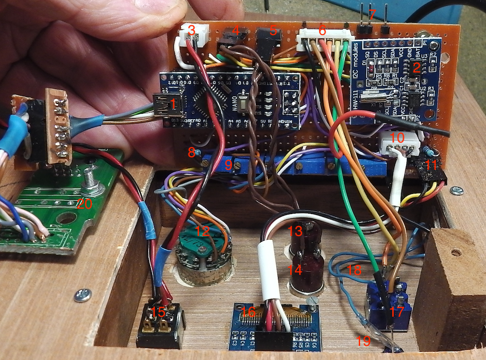

.. include:: links.rst

=======================
Documentation technique
=======================

Divers
======

Voir :

* le `dépôt sur github`_
* le `sketch de l'arduino sur github`_

Photo de l'intérieur du thermostat
==================================

Liste des éléments
==================

Les N° ci-dessous des éléments correspondent aux N° de la photo ci-dessus.

1. :index:`Arduino` NANO
2. Module :index:`RTC` (:index:`I2C`)
3. Connecteur d'arrivée de l'alimentation (**+** vers Vin de l'arduino)
4. connectique vers bouton **-**, bouton poussoir **13**
5. connectique vers bouton **+**, bouton poussoir **14**
6. connectique de gestion du commutateur 3 positions et des LEDs qui lui sont associées
7. connectique vers le relai SSR
8. résistance des ponts diviseurs associés au commutateur 6 positions (**12**)
9. ensemble des potentiomètres des ponts diviseurs associés au commutateur 6 positions (**12**)
10. connectique I2C vers l'afficheur OLED 0.96\"
11. connectique vers la sonde de température DS18B20
12. commutateur 6 positions de choix des modes de fonctionnement
13. bouton poussoir **-**
14. bouton poussoir **+**
15. interrupteur Marche/Arrêt
16. afficheur OLED 0.96\"
17. commutateur 3 positions
18. LED jaune (non visible sur cette photo)
19. LED bleue (à peine visible sur cette photo)
20. PCB de récupération avec le connecteur RJ45 pour les m-à-j de l'arduino via ISP/ICSP

Le rôle de l'arduino NANO
=========================

Rôles INPUT

1. capter la température de la pièce avec la sonde DS18B20
2. Déterminer le mode de fonctionnement avec le commutateur 6 positions (**12**)
3. gérer les commandes des réglages avec les boutons poussoirs et le commutateur 3 positions (**17**)

Rôles OUTPUT

1. Rôle principal : **Activer/Désactiver le relai SSR**
2. afficher les données sur l'écran OLED (**16**)
3. allumer/éteindre les LED bleue et jaune
4. Plus tard : transmettre les données par le bus SPI (**20**)

Les interruptions
=================

Les interruptions sont gérées sur les *Digital Pins* 2 et 3. Elles sont utilisées pour les
réglages divers : température de consigne, heure.

Deux particularités :

* un algorithme pour s'affranchir des rebonds. Voir pour cela la vidéo
  d'Eric Peronnin dont l'URL est donnée dans le code au niveau
  de la fonction :code:`btn1()` et ``blabla``
* l'appui sur les boutons poussoirs n'a pas le même effet selon le mode. Pour toujours
  les modes sauf le **5**, on modifie la température de consigne, pour le mode **5**,
  on modifie les heures et les minutes.

::

  void setup() {
    ...
    pinMode(PLUS_PIN, INPUT_PULLUP);
    pinMode(MINUS_PIN, INPUT_PULLUP);
    attachInterrupt(digitalPinToInterrupt(BTN1), btn1, FALLING);
    attachInterrupt(digitalPinToInterrupt(BTN2), btn2, FALLING);
    ...

le module RTC
=============

le relai SSR et la connectique
==============================

La sonde DS18B20 et sa connectique
==================================

Les modes de fonctionnement et les ponts diviseurs
==================================================

Mise-à-jour du programme de l'arduino via ISP/ICSP
==================================================

Détails à propos du sketch de l'arduino
=======================================

Organisation du sketch

les interruptions

les hystérésis : de temps et de température

