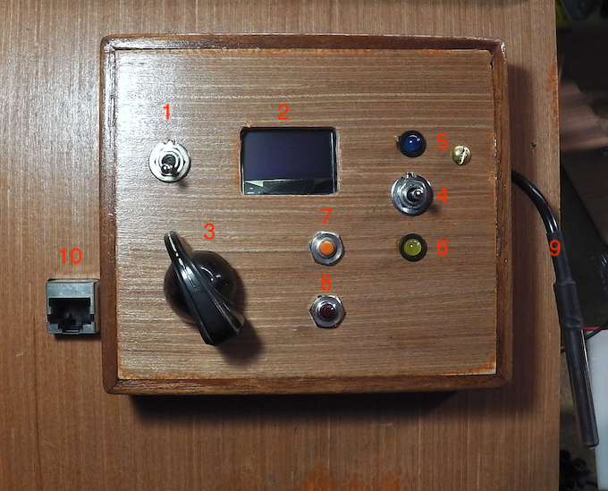

.. include:: links.rst

=========================
Documentation utilisateur
=========================

Présentation de la face avant
-----------------------------

1. Interrupteur Marche/arrêt
2. écran OLED 0.96\" : 4 lignes d'affichage
3. commutateur à 6 positions pour la sélection du mode de fonctionnement
4. commutateur 3 positions en fonction du mode. Voir ci-dessous.
5. LED Bleue
6. LED Jaune
7. bouton +
8. bouton -
9. sonde de température
10. connecteur RJ45 pour la mise-à-jour du programme de l'arduino NANO

L'afficheur
-----------

Il affiche toujours 4 lignes :

1. la température actuelle mesurée à la sonde
2. la température de consigne, c'est-à-dire la température de la pièce attendue. Si la température attendue est
   supérieure à la température mesurée, le système déclenche le relai, la pompe à chaleur se met en action et
   la ligne de la température demandée se termine par une "*" (astérisque). Cf *mode 0*
3. l'heure (avec **heures:minutes:secondes**)
4. les 6 modes : 
    * *mode 0* : fonctionnement standart
    * *mode 1* : température de consigne pré-réglée à 14°
    * *mode 2* : température de consigne pré-réglée à 19°
    * *mode 3* : programmation des températures au cours de la journée en fonction de l'heure
    * *mode 4* : programmation des températures au cours de la journée en fonction de l'heure
    * *mode 5* : réglage de l'heure. Utile lors des changements d'heures été/hiver.

**NB**: les paramètres des modes 1 à 4 peuvent varier en fonction des m-à-j du programme de l'arduino

mode 0 : par défaut
-------------------

C'est le mode "par défaut".

**On fait varier la température de consigne avec les boutons + (7, plus) et - (8, moins)**

En fonction de la position du commutateur **4** à 3 positions, le niveau de changement de température varie :

* Si **4** est en position **médiane**, on fait varier la température de **0.5°**, aucune des LEDs (bleue, jaune) n'est alumée,
* Si **4** est en position **haute**, on fait varier la température de **1.0°**, la LED bleue est alumée,
* Si **4** est en position **basse**, on fait varier la température de **0.2°**, la LED jaune est alumée.

mode 1 : pré-réglage à 14°
--------------------------

La température pré-réglée ne peut être modifiée que par une m-à-j du programme de l'arduino.

Actuellement **14°**.

mode 2 : pré-réglage à 19°
--------------------------

La température pré-réglée ne peut être modifiée que par une m-à-j du programme de l'arduino.

Actuellement **19°**.

mode 3 : programme 1
--------------------

Le programme des températures au cours de la journée en fonction de l'heure ne peut être modifiée que
par une m-à-j du programme de l'arduino.

Un exemple à tester et/ou à valider :

+------------+------+------+------+------+------+------+
|heures      | 5.10 | 6.50 | 11.0 | 14.0 | 19.0 | 22.0 |
+------------+------+------+------+------+------+------+
|Températures| 19.0 | 17.0 | 19.0 | 17.0 | 19.0 | 16.5 |
+------------+------+------+------+------+------+------+

    .. note:: les heures sont notées ici de façon un peu particulières, ces valeurs
        sont tirées du programme de l'arduino NANO. *5.10* = 5h et 10mn. *6.50* = 6h et 50mn.

mode 4 : programme 2
--------------------

Le programme des températures au cours de la journée en fonction de l'heure ne peut être modifiée que
par une m-à-j du programme de l'arduino.

Actuellement (25/11/2021), ce mode n'est pas programmé.

mode 5 : réglage de l'heure
---------------------------

Réglage de l'heure :

* Si le commutateur **4** est en position haute, on règle les heures
* Si le commutateur **4** est en position basse, on règle les minutes
* La position médiane de ce commutateur est neutre et rien ne se produit.

Une fois en mis en *mode 5* et le commutateur **4** en position haute (LED bleue alumée), un appui sur le bouton **7** ajoute une
heure, un appui sur le bouton **8** retire une heure.

De même, en *mode 5* et le commutateur **4** en position basse (LED jaune alumée), on fait varier les minutes en actionnant
les boutons **7** et **8**.
